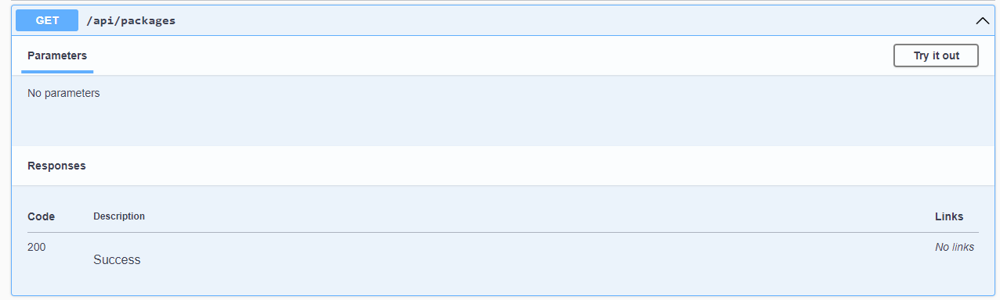

# DevTrackR

## API de cadastro e acompanhamento de pacotes

## Stack utilizada

 -   
 
 -    
 
## Deployment

## Funcionalidades

- Cadastro de novo pacote
- Visualização de um pacote especifico
- Visualização geral dos Pacotes
- Atualização do estado do pacote

## Screenshots

